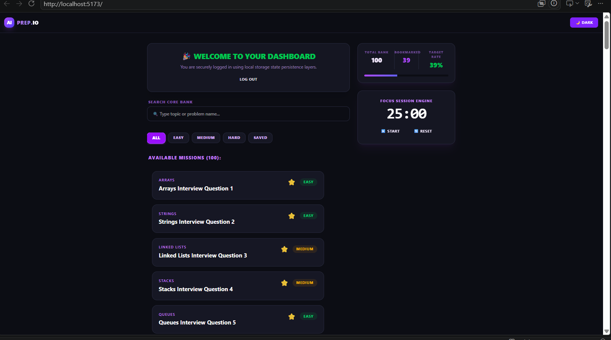

# AI PREP.IO

AI PREP.IO is a sleek React-based interview preparation platform designed to help users sharpen their coding and technical interview skills through structured practice, smart tracking, and focused study sessions. Built for productivity and clarity, the platform blends interview questions, analytics, and a lightweight Pomodoro workflow into a polished dashboard experience.

## Key Features

- Authentication and session state management through `AuthContext.jsx` for simple login/logout behavior.
- Analytics overview that highlights key metrics such as Total Done questions, Bookmarked questions, and Target Rate percentage.
- Focus session engine powered by a Pomodoro-style timer with Start and Reset controls for efficient learning intervals.
- Problem Mission Board featuring coding challenges organized by topics such as Arrays, Strings, Linked Lists, Stacks, and Queues.
- Difficulty-based categorization with tags like Easy, Medium, and Hard to guide practice sessions.
- Dynamic search and filtering tools to find problems by topic or question name with category tabs including All, Easy, Medium, Hard, and Saved.
- Global dark/light theme toggle managed via `ThemeContext.jsx` for a comfortable study experience.
- Bookmarking support for saving important questions and tracking progress across the session.

## Folder Structure

```bash
src/
├── components/
│   ├── Button.jsx
│   ├── Input.jsx
│   ├── Navbar.jsx
│   ├── PomodoroTimer.jsx
│   ├── ProgressTracker.jsx
│   └── QuestionCard.jsx
├── context/
│   ├── AuthContext.jsx
│   └── ThemeContext.jsx
├── data/
│   └── questions.json
├── hooks/
│   ├── useDebounce.js
│   └── useForm.js
├── pages/
│   └── Login.jsx
├── assets/
│   └── ScreenShot/
│       └── home.png
├── App.jsx
├── index.css
├── main.jsx
└── App.css
```

### Structure Overview

- `components/`: Reusable UI blocks such as the navbar, buttons, timer, filters, progress cards, and question list components.
- `pages/`: Page-level views such as the login screen used in the app flow.
- `context/`: Global state providers for authentication and theme switching.
- `hooks/`: Helper hooks for debounced search behavior and form handling.
- `data/`: Stores interview question data used for the dashboard mission board.

## Tech Stack

- React.js
- Vite
- Tailwind CSS
- JavaScript / JSX
- LocalStorage for auth, theme, and bookmark persistence

## Visual Preview



## Installation & Local Development

Follow these steps to set up and run the project locally:

1. Clone the repository:

```bash
git clone <your-repository-url>
cd ai-interview-platform
```

2. Install dependencies:

```bash
npm install
```

3. Start the development server:

```bash
npm run dev
```

4. Open the app in your browser. Vite will typically run the project at:

```bash
http://localhost:5173
```

### Production Build

```bash
npm run build
```

## Project Goal

AI PREP.IO is designed to make interview preparation more focused, measurable, and motivating. It helps users:

- stay consistent with practice sessions,
- review targeted coding problems,
- track saved and completed work,
- and maintain a productive study rhythm through clear dashboard insights.

## License

This project is for educational and portfolio use.
